# LuaTikZ

Fast LuaLaTeX TikZ rendering with full library support, live preview, a visual touch/stylus TikZ editor, RTL support, and simple diagram helpers.

Render `tikz` and `luatikz` fenced code blocks in Obsidian. Desktop can use local LuaLaTeX or TikZJax; mobile uses TikZJax. Enable **LuaTikZ** under Settings → Community plugins and choose your prefered Renderer.


#### What's new

- **Visual TikZ editor** the floating preview now has an **Edit** mode which opens a full window with the editor filling the pane: which contains shapes, selection tools, function plotter, circuit components, handwriting, styiling and much more. [Details](https://github.com/SharbelMarshi/obsidian-LuaTikz-plugin/blob/main/docs/features/visual-editor.md)
- **Freehand ink** strokes are smoothed, simplified, and fitted to editable Bézier paths, with an adjustable smoothing setting.
- **Touch, stylus, and Apple Pencil** one finger pans, two fingers pinch-zoom; an explicit **Finger draw** toggle makes one finger draw; a pen always draws, with practical palm rejection while it's near the glass.
- **Floating preview on mobile** the inline live preview (and the Edit mode) now works on iPad, Android tablets, and phones, rendering through TikZJax. [Details](https://github.com/SharbelMarshi/obsidian-LuaTikz-plugin/blob/main/docs/features/live-preview.md)


## Requirements

**Mobile (iOS / Android)**

LuaTikZ runs on Obsidian mobile. Diagrams render in reading view through the bundled TikZJax runtime so there is no need for a local TeX install and no shell access required.

**Desktop**

For a full support of libraries, a Local LuaLatex (recommended) is required and choose **Local Lualatex renderer** through plugin's settings

- LuaLaTeX (MacTeX or TeX Live)
- `pdftocairo` for PDF → SVG (`brew install poppler` on macOS)

For regular use keep **TikzJax Renderer** and there is no need for a local TeX install.

## Usage

````markdown
```tikz or ```luatikz
\begin{tikzpicture}
.
.  -> tikz code here
.
\end{tikzpicture}
```
````

If you are interested in learning to code with TikZ, I suggest this website: [Tikz.org](https://tikz.org)

# Features

- **Background grid:** Add an optional centimeter-based grid behind rendered diagrams. [Details](https://github.com/SharbelMarshi/obsidian-LuaTikz-plugin/blob/main/docs/features/basic-diagram-features.md#background-grid)
- **RTL labels:** Use Hebrew and Arabic labels with LuaLaTeX shaping and a TikZJax fallback. [Details](https://github.com/SharbelMarshi/obsidian-LuaTikz-plugin/blob/main/docs/features/basic-diagram-features.md#rtl-labels)
- **Built-in helpers:** Use diagram macros, autocomplete, snippets, node anchors, and relative-coordinate suggestions. [Details](https://github.com/SharbelMarshi/obsidian-LuaTikz-plugin/blob/main/docs/features/basic-diagram-features.md#built-in-helpers)
- **Live preview and coordinate picking:** Preview diagrams while editing, pick coordinates on desktop, and locate source statements from rendered shapes. [Details](https://github.com/SharbelMarshi/obsidian-LuaTikz-plugin/blob/main/docs/features/live-preview.md)
- **Visual editor (Edit mode):** Draw and edit native TikZ visually with shapes, circuits, styling, freehand input, touch and stylus support, and two-way source sync. [Details](https://github.com/SharbelMarshi/obsidian-LuaTikz-plugin/blob/main/docs/features/visual-editor.md)
- **Editor assistance and export:** Get line-aware editing, linting, templates, formatting, auto-close helpers, and SVG or PNG export. [Details](https://github.com/SharbelMarshi/obsidian-LuaTikz-plugin/blob/main/docs/features/editor-and-export.md)
- **Errors and editing:** LuaTikZ maps compile failures back to the diagram, highlights affected lines, and offers plain-language explanations and suggested fixes when possible. [Details](https://github.com/SharbelMarshi/obsidian-LuaTikz-plugin/blob/main/docs/features/errors-and-editing.md)
- **Settings:** Choose renderers, fonts, preambles, caching, dark-mode behavior, editor assistance, and environment checks. [Details](https://github.com/SharbelMarshi/obsidian-LuaTikz-plugin/blob/main/docs/features/settings.md)
- **Renderers:** Use local LuaLaTeX for the full TeX toolchain or bundled TikZJax for shell-free and mobile rendering. [Details](https://github.com/SharbelMarshi/obsidian-LuaTikz-plugin/blob/main/docs/features/renderers.md)
- **Security and permissions:** Local rendering is opt-in and narrowly scoped; the detailed guide explains shell execution, temporary files, clipboard access, and bundled dependencies. [Details](
- **Hover-to-locate**: moving the pointer over a shape in the floating preview highlights the statement that drew it. [Details](https://github.com/SharbelMarshi/obsidian-LuaTikz-plugin/blob/main/docs/features/live-preview.md)
- **PNG export**: the toolbar button is now **Export** with a format menu for SVG or PNG. [Details](https://github.com/SharbelMarshi/obsidian-LuaTikz-plugin/blob/main/docs/features/editor-and-export.md#export)
- **Explained errors**: opaque LaTeX failures such as `Dimension too large` now come with a plain-language explanation of the cause and the fixes that work. [Details](https://github.com/SharbelMarshi/obsidian-LuaTikz-plugin/blob/main/docs/features/errors-and-editing.md)
- **Font settings**: override the main, Hebrew and Arabic fonts. [Details](https://github.com/SharbelMarshi/obsidian-LuaTikz-plugin/blob/main/docs/features/renderers.md#fonts-and-rtl)
- **Custom preamble**: replace the generated LuaLaTeX preamble entirely, with buttons to load the current one or reset. [Details](https://github.com/SharbelMarshi/obsidian-LuaTikz-plugin/blob/main/docs/features/renderers.md#custom-preamble)
- **Hebrew/Arabic load only when used**: and per script, so a Hebrew diagram no longer pulls in the Arabic gloss that minimal TeX installs lack. [Details](com/SharbelMarshi/obsidian-LuaTikz-plugin/blob/main/docs/features/security-and-permissions.md)

## Samples

Diagrams rendered with LuaTikZ, exported as SVG. Files in [`samples/`](samples/).

### Astronomy

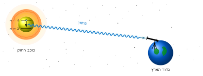

### Anatomy

|                                              |                                          |
| -------------------------------------------- | ---------------------------------------- |
| 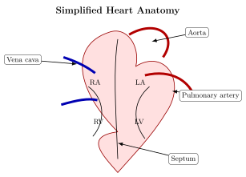   | 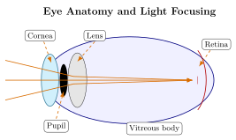   |
| 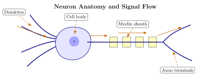 | 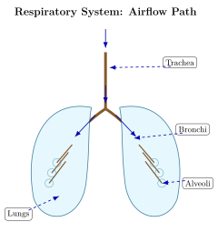 |

### Circuits and logic

| | |
|---|---|
|  |  |
| 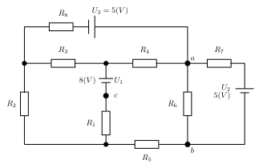 | 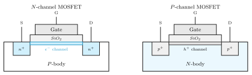 |
|  |  |

### Math and decision diagrams

| | |
|---|---|
| 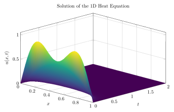 | 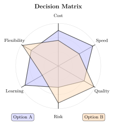 |

### Maps and layouts

| | |
|---|---|
| 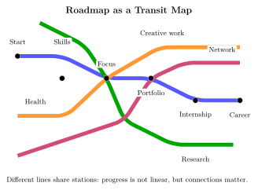 | 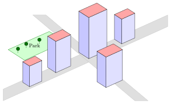 |

## License

MIT — see [LICENSE](LICENSE).
